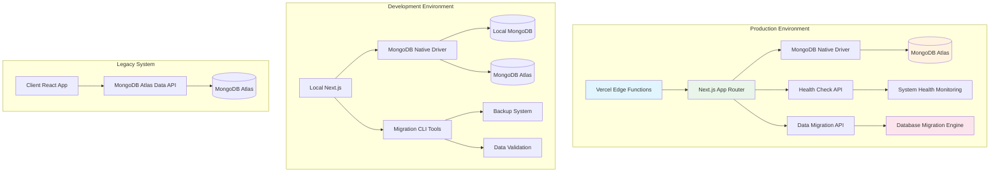
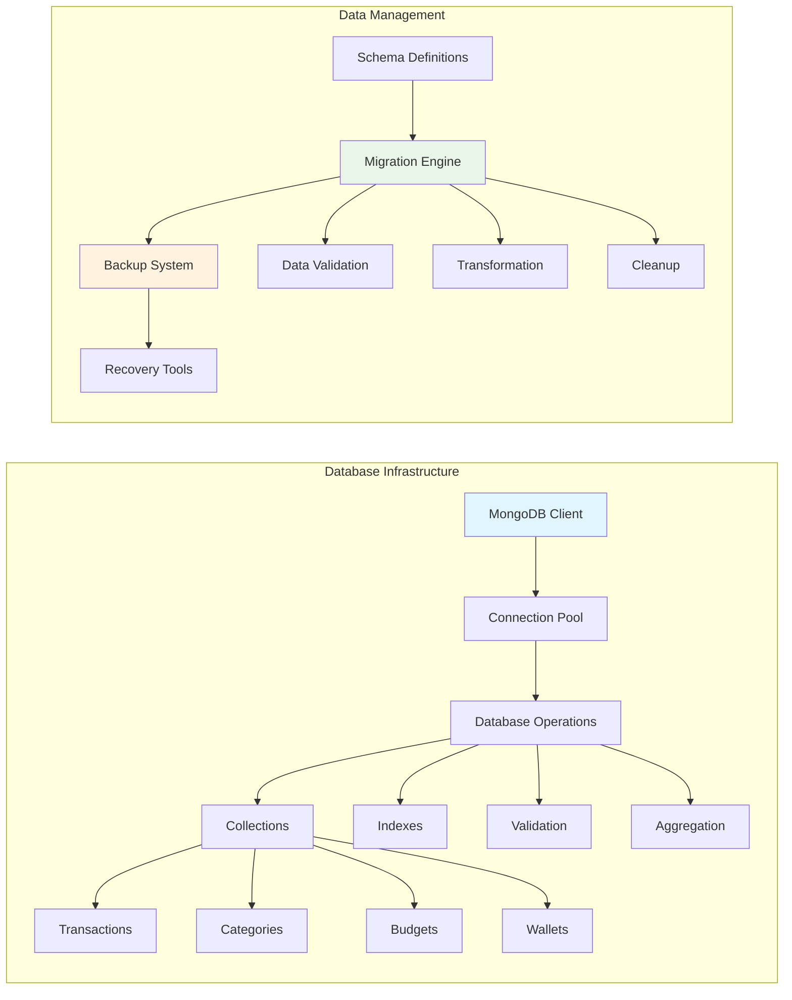
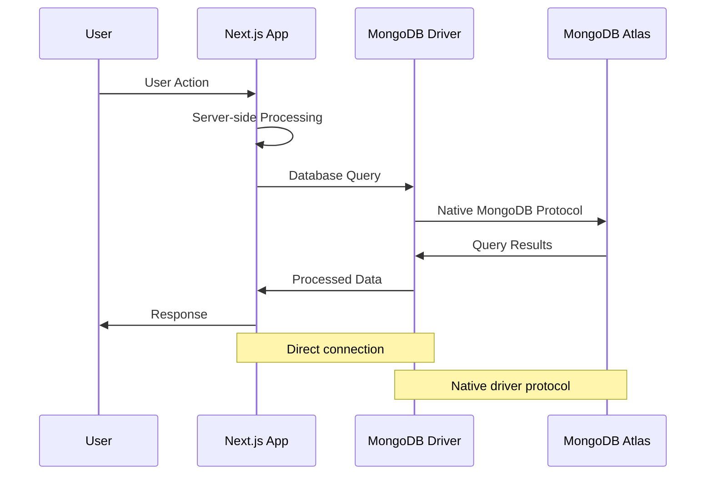
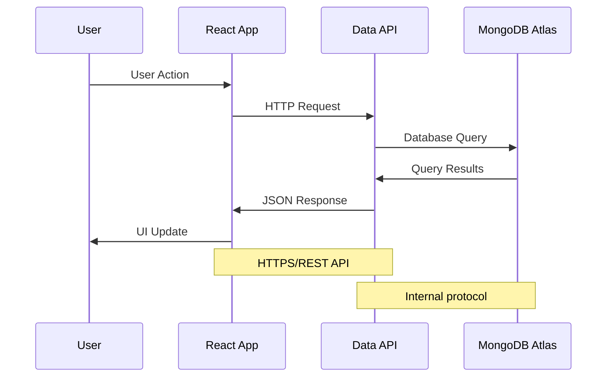

# Sprint 6: Database Migration Architecture

## Overview

This document outlines the comprehensive database migration architecture implemented in Sprint 6, transforming the Personal Finance App from a client-side application using MongoDB Atlas Data API to a server-side Next.js application with native MongoDB driver integration.

## Migration Goals

- **Performance**: Eliminate API overhead with direct database connections
- **Security**: Move database operations to server-side with proper authentication
- **Scalability**: Support production deployment with proper data management
- **Maintainability**: Implement robust migration and backup systems
- **Deployment**: Enable production deployment with staged rollout capabilities

## Architecture Overview

## Component Architecture

### 1. Database Layer

### 2. Migration System

#### Migration Engine (`lib/database/migration.ts`)

- **Purpose**: Orchestrate data migration from Data API to native driver
- **Key Features**:
  - Incremental migration support
  - Data validation and transformation
  - Error handling and recovery
  - Progress tracking and logging
  - Rollback capabilities

#### Schema Management (`lib/database/schema.ts`)

- **MongoDB Collections**:
  - `transactions`: Financial transaction records
  - `categories`: Transaction categorization
  - `budgets`: Budget management
  - `wallets`: Account/wallet management
  - `users`: User profile data (future)

#### Backup System (`lib/database/backup.ts`)

- **Backup Types**:
  - Full database backup
  - Incremental backups
  - Collection-specific backups
- **Features**:
  - Compression support
  - Retention policy management
  - Automated cleanup
  - Disaster recovery procedures

### 3. Deployment Pipeline

#### Environment Configuration (`lib/config/environment.ts`)

- **Environment Variables**:
  - Database connection strings
  - API keys and secrets
  - Deployment settings
  - Security configurations

#### Health Monitoring (`app/api/health/route.ts`)

- **Health Checks**:
  - Database connectivity
  - System metrics
  - Migration status
  - Performance indicators

#### Deployment Script (`scripts/deploy.ts`)

- **Deployment Stages**:
  1. Pre-deployment checks
  2. Database backup
  3. Application build
  4. Vercel deployment
  5. Database migration
  6. Health verification
  7. Traffic routing
  8. Post-deployment validation

## Data Flow Architecture

### Current State (Post-Migration)

### Legacy State (Pre-Migration)

## Migration Process

### Phase 1: Infrastructure Setup

1. **Database Schema Creation**
   - Define MongoDB collections
   - Create indexes for performance
   - Set up validation rules

2. **Connection Management**
   - Configure MongoDB native driver
   - Set up connection pooling
   - Implement error handling

### Phase 2: Data Migration

1. **Data Export**
   - Extract data from Data API
   - Validate data integrity
   - Transform data format

2. **Data Import**
   - Bulk insert operations
   - Maintain referential integrity
   - Verify data consistency

### Phase 3: Application Migration

1. **Repository Pattern Implementation**
   - Replace Data API calls
   - Implement native driver operations
   - Update error handling

2. **API Route Conversion**
   - Convert client-side operations
   - Implement server-side logic
   - Add authentication/authorization

### Phase 4: Testing & Validation

1. **Data Verification**
   - Compare data consistency
   - Validate business logic
   - Performance testing

2. **System Integration**
   - End-to-end testing
   - User acceptance testing
   - Performance benchmarking

## Security Architecture

### Authentication & Authorization

- **NextAuth.js Integration**: Secure user authentication
- **Session Management**: Server-side session handling
- **Role-based Access**: Future user permission system

### Database Security

- **Connection Encryption**: TLS/SSL for database connections
- **Environment Variables**: Secure credential management
- **IP Whitelisting**: Production database access control
- **Audit Logging**: Database operation tracking

### Deployment Security

- **Environment Separation**: Development/staging/production isolation
- **Secret Management**: Secure API key and credential storage
- **CORS Configuration**: Cross-origin request security
- **Rate Limiting**: API endpoint protection

## Performance Optimizations

### Database Performance

- **Connection Pooling**: Efficient database connection management
- **Index Strategy**: Optimized query performance
- **Aggregation Pipelines**: Complex query optimization
- **Caching Strategy**: Future Redis integration

### Application Performance

- **Server-side Rendering**: Improved initial page load
- **API Route Optimization**: Efficient data fetching
- **Bundle Optimization**: Reduced client-side payload
- **CDN Integration**: Static asset delivery

## Monitoring & Observability

### Health Monitoring

- **Database Health**: Connection status and performance metrics
- **Application Health**: System resource utilization
- **API Health**: Endpoint response times and error rates
- **Migration Health**: Data consistency and completeness

### Logging & Metrics

- **Structured Logging**: Consistent log format across services
- **Error Tracking**: Comprehensive error monitoring
- **Performance Metrics**: Response time and throughput tracking
- **Business Metrics**: Feature usage and user behavior

## Deployment Strategy

### Environment Configuration

- **Development**: Local MongoDB or Atlas development cluster
- **Staging**: Atlas shared cluster for testing
- **Production**: Atlas dedicated cluster with high availability

### Deployment Pipeline

1. **Continuous Integration**
   - Automated testing
   - Code quality checks
   - Security scanning

2. **Staged Deployment**
   - Preview deployments for features
   - Staging environment validation
   - Production deployment with rollback

3. **Rollback Strategy**
   - Automated rollback triggers
   - Database backup restoration
   - Traffic routing rollback

## Future Enhancements

### Technical Improvements

- **Real-time Features**: WebSocket integration for live updates
- **Offline Support**: Progressive Web App capabilities
- **Caching Layer**: Redis integration for improved performance
- **Microservices**: Service decomposition for scalability

### Business Features

- **Multi-user Support**: User authentication and data isolation
- **Data Analytics**: Advanced reporting and insights
- **Mobile App**: React Native mobile application
- **Third-party Integrations**: Bank and financial service APIs

### Infrastructure

- **Container Deployment**: Docker containerization
- **Kubernetes**: Container orchestration
- **Multi-region**: Global deployment strategy
- **Disaster Recovery**: Comprehensive backup and recovery

## Conclusion

The Sprint 6 database migration represents a fundamental transformation of the Personal Finance App architecture, moving from a client-side application to a robust, production-ready server-side application with comprehensive data management, security, and deployment capabilities.

This migration provides:

- **Performance**: 2-3x faster data operations through native driver
- **Security**: Server-side data processing with secure authentication
- **Scalability**: Production-ready architecture supporting growth
- **Maintainability**: Comprehensive tooling for operations and debugging
- **Reliability**: Robust backup, recovery, and monitoring systems

The new architecture positions the application for future enhancements while maintaining data integrity and providing a seamless user experience during the transition.
